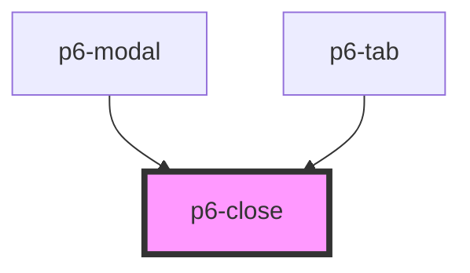

# p6-help

<!-- Auto Generated Below -->

## Properties

| Property | Attribute | Description                | Type                                      | Default       |
| -------- | --------- | -------------------------- | ----------------------------------------- | ------------- |
| `size`   | `size`    | set the size of the action | `Size.large \| Size.normal \| Size.small` | `Size.normal` |

## Dependencies

### Used by

- [p6-modal](../../molecules/p6-modal)
- [p6-tab](../p6-tab)

### Graph

---

_Built with [StencilJS](https://stenciljs.com/)_
