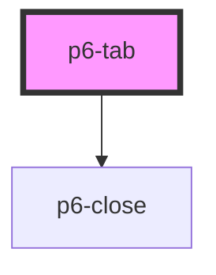

# p6-tab

<!-- Auto Generated Below -->

## Properties

| Property           | Attribute   | Description                                                                                                                         | Type                  | Default     |
| ------------------ | ----------- | ----------------------------------------------------------------------------------------------------------------------------------- | --------------------- | ----------- |
| `active`           | `active`    | Set the tab active                                                                                                                  | `boolean`             | `false`     |
| `closeable`        | `closeable` | Set the tab closeable                                                                                                               | `boolean`             | `false`     |
| `for` _(required)_ | `for`       | A tab-content id must be provided for each `p6-tab`. It's used internally to reference the selected tab and to switch between them. | `string`              | `undefined` |
| `tooltip`          | `tooltip`   | Set the text to be display in a tooltip                                                                                             | `string \| undefined` | `undefined` |

## Events

| Event      | Description                          | Type                           |
| ---------- | ------------------------------------ | ------------------------------ |
| `p6Close`  | Emitted when the tab has been closed | `CustomEvent<{ id: string; }>` |
| `p6Select` | Emitted when the tab is clicked      | `CustomEvent<{ id: string; }>` |

## Dependencies

### Depends on

- [p6-close](../p6-close)

### Graph

---

_Built with [StencilJS](https://stenciljs.com/)_
