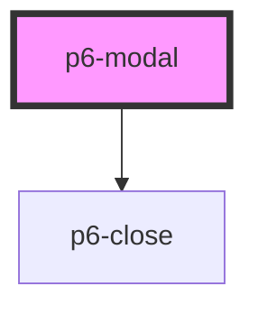

# p6-modal

<!-- Auto Generated Below -->

## Properties

| Property  | Attribute  | Description                                    | Type      | Default |
| --------- | ---------- | ---------------------------------------------- | --------- | ------- |
| `hasCard` | `has-card` | Display a modal with a head, a body and a foot | `boolean` | `false` |
| `open`    | `open`     | Open the modal                                 | `boolean` | `false` |

## Dependencies

### Depends on

- [p6-close](../../atoms/p6-close)

### Graph

---

_Built with [StencilJS](https://stenciljs.com/)_
